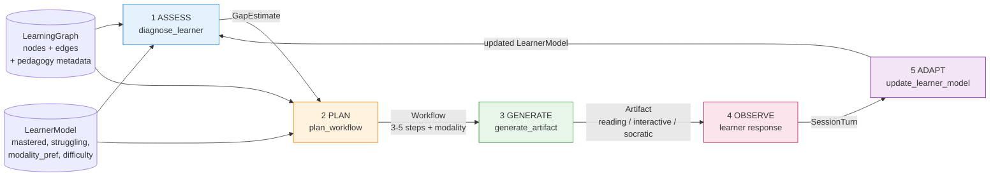
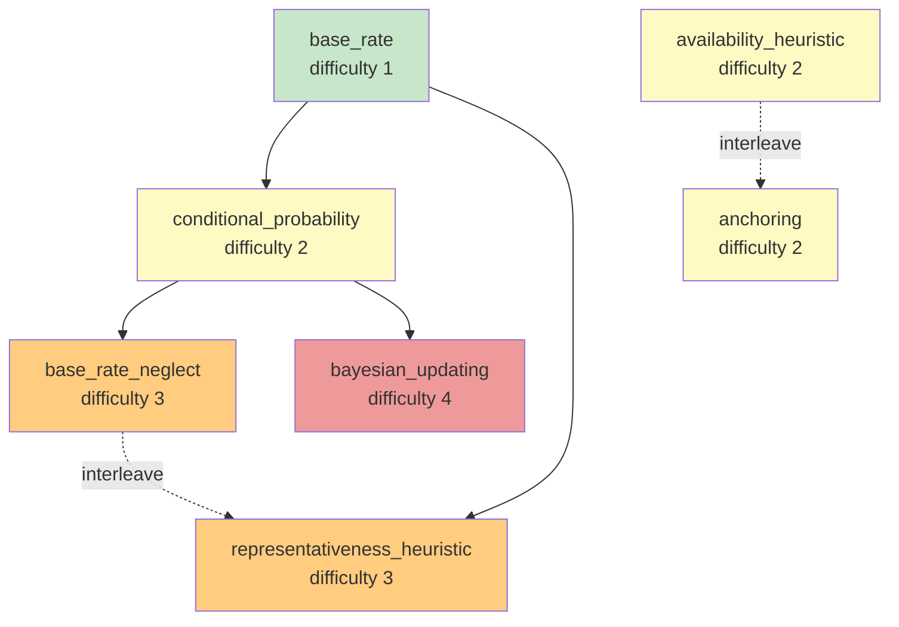

# adaptive-learning-agent

**An agent that learns how a person learns** — ingests an arbitrary domain (paper, URL, file), builds a learning-science-grounded knowledge graph, generates an adaptive curriculum on the fly, and proves the adaptation worked via a first-class eval harness.

> Evaluation and reliability infrastructure for production AI agents, applied to adaptive pedagogy. The eval harness is the headline.

---

## 30-second "what this proves"

In an era where AI does the heavy lifting (coding, analysis, content), the bottleneck shifts to **human learning speed**. The scarce skill is absorbing and adapting faster than the tooling changes.

This repo is a public reference implementation that demonstrates four hard things working together:

1. **Learning graph generated from source material** (not hand-curated) via LLM parsing, with named pedagogy metadata on every node and edge.
2. **Modality adaptation** — the agent personalizes the *medium* (reading / interactive / Socratic), not just content. This is the differentiator vs. existing edtech (Squirrel AI, Khanmigo, Adaptemy), which are mostly rules-based routing or pure dialogue.
3. **Agentic workflow generation** — the LLM authors a 3-5 step teaching sequence on the fly from learner state, then executes it.
4. **Eval harness with rationale per judge** — auditable proof that the adaptive decisions were correct.

---

## Architecture

The agent generates a workflow on the fly from learner state, executes it, observes, then regenerates. The workflow is the output of an agentic decision, not a fixed chain.



**The agentic decision is concentrated in step 2 (PLAN).** The LLM authors the step sequence, picks the modality, and cites a pedagogy principle per step — all from learner state. Steps 1, 3, 5 are deterministic plumbing; step 4 is the human.

### Stack

- **Orchestration:** single-loop Programmatic Tool Calling — the five tools (§6 below) are functions in the execution namespace; the LLM authors the workflow that chains them.
- **LLM:** Claude `claude-opus-4-8` with adaptive thinking. Frontier baseline makes the evals bulletproof. (An open-model branch is planned — see *Roadmap*.)
- **Memory / persistence:** file-backed JSON store, lookup by ID. The interface is shaped so a real vector store (Chroma, FAISS, pgvector) is a one-file swap.
- **I/O:** Pydantic-validated everywhere — every tool returns a typed model; the agent fails fast on malformed LLM output.
- **Streaming:** FastAPI with Server-Sent Events for incremental artifact rendering.

### Tools (§6)

Five tools, each returning a Pydantic model:

1. `extract_learning_graph(source) → LearningGraph` — parse paper/URL/file into nodes + edges with pedagogy metadata. Checks vector store first; generates + caches on miss.
2. `diagnose_learner(learner_state, graph) → GapEstimate` — produce a structured gap estimate.
3. `plan_workflow(gap, learner_model, graph) → Workflow` — author the multi-step teaching sequence + choose modality.
4. `generate_artifact(step, modality) → Artifact` — build the teaching artifact (reading / interactive / Socratic) in the chosen modality.
5. `update_learner_model(response, learner_model) → LearnerModel` — persist the adaptation.

### What a learning graph looks like

Below is the eval graph (`evals/golden/graphs/cognitive_biases.json`) — 7 concepts, 5 edges, the same shape the extractor produces from raw source material. Nodes are colored by difficulty; solid arrows are prerequisites, dashed are *interleave_with* (concepts the agent will mix during practice because they're easily confused).



The agent uses this structure for two of its key decisions:

- **Prerequisite-gated diagnosis** — it won't teach `bayesian_updating` to a learner who hasn't mastered `conditional_probability`; it backfills the missing prerequisite first (case_06).
- **Interleaved practice** — once a learner masters `base_rate_neglect`, the agent introduces `representativeness_heuristic` *paired with it*, because the two are commonly confused (Rohrer & Taylor 2007).

### Worked example

[`docs/worked_example_case_02.md`](docs/worked_example_case_02.md) walks through one golden case end-to-end — input learner state, diagnosed gap, planned workflow, the actual Socratic dialogue the agent generated, and the per-judge scores. This is the clearest way to see "modality adaptation" working: the learner's *stated* preference is reading, but two failed reading attempts on the target concept made the agent override that and go Socratic.

### Learning-science citations

The graph extractor's pedagogy metadata is grounded in named principles, cited in the prompt and in code:

- **Spaced repetition** — Ebbinghaus (1885); Cepeda et al. (2008)
- **Interleaving** — Rohrer & Taylor (2007)
- **Desirable difficulty** — Bjork & Bjork (2011)
- **Cognitive load theory** — Sweller (1988)

---

## Eval harness — the headline

Three judges score every workflow, each returning `{score, rationale}`:

| Judge | What it checks |
|---|---|
| **gap_to_pedagogy** | Did the generated lesson target the diagnosed gap? Are pedagogy principles appropriate? |
| **modality_fit** | Was the chosen modality right for this learner's profile? (Struggling → Socratic; new concept → Reading; procedural → Interactive.) |
| **adaptive_progression** | Did difficulty adjust correctly given performance? (Within `[1, 5]`; demote on multiple struggles; promote on sustained mastery.) |

Six golden cases exercise the central adaptation decisions:

| Case | Tests |
|---|---|
| `case_01_novice_start` | Empty-history learner → foundational concept, reading, difficulty 1-2 |
| `case_02_struggling_use_socratic` | Struggling with `base_rate_neglect` → Socratic modality (not more reading) |
| `case_03_mastered_basics_practice` | Mastered prerequisites → advance to interactive practice |
| `case_04_step_down_overwhelmed` | Multiple struggles at level 4 → demote difficulty to consolidate |
| `case_05_interleave_confusables` | Mastered `base_rate_neglect` → introduce `representativeness_heuristic` (interleave) |
| `case_06_prereq_gap_blocks_advance` | Targets `bayesian_updating` but missing prereq → backfill `conditional_probability` |

### Running the evals

```bash
pip install -r requirements.txt
export ANTHROPIC_API_KEY=sk-ant-...
python run_evals.py --verbose
```

A case **passes** when all three judges score ≥ 0.6. Verbose mode prints the per-case rationale — strangers can read why each judge gave the score it did.

---

## Running the server

```bash
python run_server.py        # localhost:8000
```

```bash
# Stream a session over SSE
curl -N -X POST http://localhost:8000/sessions/start_stream \
  -H "Content-Type: application/json" \
  -d '{"user_id": "alice", "domain_id": "cognitive_biases"}'

# Or get the same content as one JSON response
curl -X POST http://localhost:8000/sessions/start \
  -H "Content-Type: application/json" \
  -d '{"user_id": "alice", "domain_id": "cognitive_biases"}'

# Respond to the current artifact
curl -X POST http://localhost:8000/sessions/<session_id>/respond \
  -H "Content-Type: application/json" \
  -d '{"correct": true, "notes": "got it on first try"}'
```

A sample domain (cognitive biases) ships in `domains/cognitive_biases.md`. Drop additional Markdown files there to teach new domains.

---

## Guardrails (visible by design)

- **Output validation** — every tool return is a Pydantic model; the loop fails fast on malformed LLM output instead of silently propagating bad state.
- **Difficulty ceiling/floor** — clamped to `[1, 5]` so the agent neither trivializes nor overwhelms.
- **Prereq integrity** — the graph extractor rejects nodes that reference unknown prerequisites; the diagnoser rejects targets not in the graph.
- **Context-budget posture** — the model uses adaptive thinking, so reasoning depth scales with task complexity. Stale learner-history turns can be evicted in a future iteration; the schema already carries timestamps.

---

## Repo layout

```
adaptive-learning-agent/
├── README.md
├── HANDOFF.md                 # the V1 build spec
├── pyproject.toml / requirements.txt
├── run_server.py / run_evals.py
├── src/
│   ├── schemas.py             # All Pydantic models (single source of truth)
│   ├── llm.py                 # Anthropic SDK wrapper + JSON-schema parsing
│   ├── agent/loop.py          # ASSESS → PLAN → GENERATE → OBSERVE → ADAPT
│   ├── tools/                 # The 5 tools (§6)
│   ├── graph/extractor.py     # Domain → LearningGraph (LLM-extracted, cached)
│   ├── memory/store.py        # File-backed store (vector-store-shaped interface)
│   └── server/app.py          # FastAPI + SSE
├── evals/
│   ├── judges/                # The 3 judges
│   ├── golden/                # 6 hand-authored cases + the eval graph
│   └── runner.py              # Harness — emits the results table
└── domains/
    └── cognitive_biases.md    # Sample domain (drop more files here)
```

---

## Roadmap (intentionally out of scope for V1)

- **Video modality** — expensive; reading / interactive / Socratic only for V1.
- **Open-model backend** — note as a future branch; Claude is the frontier baseline that makes the evals bulletproof.
- **Multi-user crowdsourcing UI for graphs** — graphs are reusable internally already; no community UI yet.
- **Real vector store backend** — the `MemoryStore` interface is shaped for this; swap `src/memory/store.py` to a Chroma/FAISS/pgvector backend without touching call sites.
