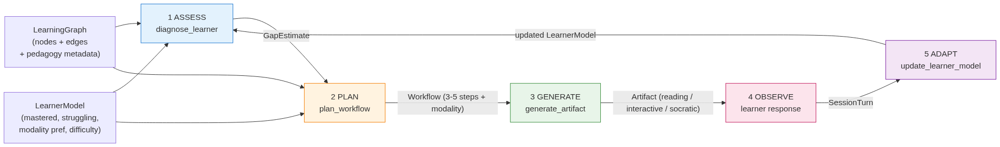
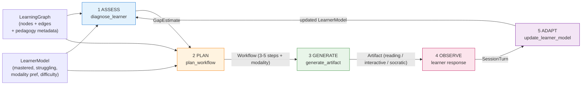
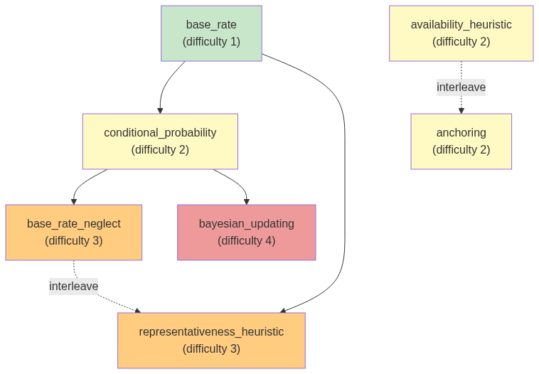

# adaptive-learning-agent

[](https://github.com/abhijeetgupta23/ai-agent-to-learn-faster-and-better/actions/workflows/ci.yml)

**An agent that learns how a person learns** — ingests an arbitrary domain (paper, URL, file), builds a learning-science-grounded knowledge graph, generates an adaptive curriculum on the fly, and proves the adaptation worked via a first-class eval harness.

> Evaluation and reliability infrastructure for production AI agents, applied to adaptive pedagogy. The eval harness is the headline.

> 👋 **Not an engineer?** Read the plain-English [User Guide](docs/USER_GUIDE.md) instead — what this is and how to use it, no jargon.

---

## In a sentence

| | |
|---|---|
| **Input** | A subject (file / URL / paper) + a learner (what they know, what they're stuck on, how hard things should be). |
| **Output** | The right next lesson for that one person, right now — *what* topic, in *which* format (reading / interactive quiz / Socratic dialogue), at *what* difficulty — plus the actual lesson generated on the spot. |
| **Proof it's right** | Three independent LLM judges score every decision against the rules above; six golden test cases catch regressions. Currently passing 6/6. |
| **What it costs** | ~**$0.17** per teaching session, ~**$0.86** per full eval run, ~**$0.11** one-time per domain ingested (then cached forever). [Full cost analysis.](docs/COST_ANALYSIS.md) |

**Example.** Alice has been reading about cognitive biases. She knows *base rates* and *conditional probability*, but failed *base rate neglect* twice — both attempts were reading-based.

Feed her in, and the agent decides: *teach* `base_rate_neglect` *as a* **Socratic dialogue** *at difficulty 2 — re-reading isn't working, dialogue surfaces the misconception.* It then writes the actual dialogue. Two of the three judges score this 1.0 with rationale citing the same evidence the agent used. ([Worked example.](docs/worked_example_case_02.md))

**Same thing, on AI as the topic.** Feed it [`domains/ai.md`](domains/ai.md) (13 concepts: tokens, embeddings, attention, transformers, context window, …). For a learner who's mastered tokens/embeddings/attention/transformers and failed `tool_use` twice, the agent diagnoses the actual gap as `context_window` — a prerequisite of `tool_use` that was never taught — and writes a reading that explicitly bridges from the mastered `attention` concept to the new `context_window` one. ([Full AI walkthrough, with screenshots.](docs/ai_use_case.md))

---

## 30-second "what this proves"

In an era where AI does the heavy lifting (coding, analysis, content), the bottleneck shifts to **human learning speed**. The scarce skill is absorbing and adapting faster than the tooling changes.

This repo is a public reference implementation that demonstrates four hard things working together:

1. **Learning graph generated from source material** (not hand-curated) via LLM parsing, with named pedagogy metadata on every node and edge.
2. **Modality adaptation** — the agent personalizes the *medium* (reading / interactive / Socratic), not just content. This is the differentiator vs. existing edtech (Squirrel AI, Khanmigo, Adaptemy), which are mostly rules-based routing or pure dialogue.
3. **Agentic workflow generation** — the LLM authors a 3-5 step teaching sequence on the fly from learner state, then executes it.
4. **Eval harness with rationale per judge** — auditable proof that the adaptive decisions were correct.

---

## Architecture

The agent generates a workflow on the fly from learner state, executes it, observes, then regenerates. The workflow is the output of an agentic decision, not a fixed chain.



<details>
<summary>Mermaid source</summary>



</details>

**The agentic decision is concentrated in step 2 (PLAN).** The LLM authors the step sequence, picks the modality, and cites a pedagogy principle per step — all from learner state. Steps 1, 3, 5 are deterministic plumbing; step 4 is the human.

> **Not a black box.** Every LLM call records its prompt, the model's *summarized reasoning*, and the parsed output. Run `python run_evals.py --trace docs/traces` and read the generated `.md` files to watch the agent reason through each decision. [`docs/HOW_IT_WORKS.md`](docs/HOW_IT_WORKS.md) walks the whole pipeline call-by-call against a real captured trace.

> **See it run live.** [`docs/VISUAL_WALKTHROUGH.md`](docs/VISUAL_WALKTHROUGH.md) is a phase-by-phase visual: six screenshots from a real session, captured by Playwright driving the live SSE stream. The page that produced them is [`docs/visual/index.html`](docs/visual/index.html) — a single static file served by FastAPI at `/visual`, no build step.

### Stack

- **Orchestration:** single-loop Programmatic Tool Calling — the five tools (§6 below) are functions in the execution namespace; the LLM authors the workflow that chains them.
- **LLM:** Claude `claude-opus-4-8` with adaptive thinking. Frontier baseline makes the evals bulletproof. (An open-model branch is planned — see *Roadmap*.)
- **Memory / persistence:** file-backed JSON store, lookup by ID. The interface is shaped so a real vector store (Chroma, FAISS, pgvector) is a one-file swap.
- **I/O:** Pydantic-validated everywhere — every tool returns a typed model; the agent fails fast on malformed LLM output.
- **Streaming:** FastAPI with Server-Sent Events for incremental artifact rendering.

### Tools (§6)

Five tools, each returning a Pydantic model:

1. `extract_learning_graph(source) → LearningGraph` — parse paper/URL/file into nodes + edges with pedagogy metadata. Checks vector store first; generates + caches on miss.
2. `diagnose_learner(learner_state, graph) → GapEstimate` — produce a structured gap estimate.
3. `plan_workflow(gap, learner_model, graph) → Workflow` — author the multi-step teaching sequence + choose modality.
4. `generate_artifact(step, modality) → Artifact` — build the teaching artifact (reading / interactive / Socratic) in the chosen modality.
5. `update_learner_model(response, learner_model) → LearnerModel` — persist the adaptation.

### What a learning graph looks like

Below is the eval graph (`evals/golden/graphs/cognitive_biases.json`) — 7 concepts, 5 edges, the same shape the extractor produces from raw source material. Nodes are colored by difficulty; solid arrows are prerequisites, dashed are *interleave_with* (concepts the agent will mix during practice because they're easily confused).



<details>
<summary>Mermaid source</summary>


</details>

The agent uses this structure for two of its key decisions:

- **Prerequisite-gated diagnosis** — it won't teach `bayesian_updating` to a learner who hasn't mastered `conditional_probability`; it backfills the missing prerequisite first (case_06).
- **Interleaved practice** — once a learner masters `base_rate_neglect`, the agent introduces `representativeness_heuristic` *paired with it*, because the two are commonly confused (Rohrer & Taylor 2007).

### Worked example

[`docs/worked_example_case_02.md`](docs/worked_example_case_02.md) walks through one golden case end-to-end — input learner state, diagnosed gap, planned workflow, the actual Socratic dialogue the agent generated, and the per-judge scores. This is the clearest way to see "modality adaptation" working: the learner's *stated* preference is reading, but two failed reading attempts on the target concept made the agent override that and go Socratic.

### Use case: the seven Naval disciplines

[`docs/naval_use_case.md`](docs/naval_use_case.md) traces the agent across two of Naval Ravikant's seven recommended fields (psychology, persuasion) on the same learner. Shows the agent producing two structurally different curricula from two LLM-extracted graphs, picking modality from learner state in each, and surfacing one cross-domain bridge (`loss_aversion` appears in both graphs) that points at the natural V2 extension. The other five domains ship as Markdown files in [`domains/`](domains/) — drop in any other source material to add a new one.

### Learning-science citations

The graph extractor's pedagogy metadata is grounded in named principles, cited in the prompt and in code:

- **Spaced repetition** — Ebbinghaus (1885); Cepeda et al. (2008)
- **Interleaving** — Rohrer & Taylor (2007)
- **Desirable difficulty** — Bjork & Bjork (2011)
- **Cognitive load theory** — Sweller (1988)

---

## Eval harness — the headline

Three judges score every workflow, each returning `{score, rationale}`:

| Judge | What it checks |
|---|---|
| **gap_to_pedagogy** | Did the generated lesson target the diagnosed gap? Are pedagogy principles appropriate? |
| **modality_fit** | Was the chosen modality right for this learner's profile? (Struggling → Socratic; new concept → Reading; procedural → Interactive.) |
| **adaptive_progression** | Did difficulty adjust correctly given performance? (Within `[1, 5]`; demote on multiple struggles; promote on sustained mastery.) |

Six golden cases exercise the central adaptation decisions:

| Case | Tests |
|---|---|
| `case_01_novice_start` | Empty-history learner → foundational concept, reading, difficulty 1-2 |
| `case_02_struggling_use_socratic` | Struggling with `base_rate_neglect` → Socratic modality (not more reading) |
| `case_03_mastered_basics_practice` | Mastered prerequisites → advance to interactive practice |
| `case_04_step_down_overwhelmed` | Multiple struggles at level 4 → demote difficulty to consolidate |
| `case_05_interleave_confusables` | Mastered `base_rate_neglect` → introduce `representativeness_heuristic` (interleave) |
| `case_06_prereq_gap_blocks_advance` | Targets `bayesian_updating` but missing prereq → backfill `conditional_probability` |

### Running the evals

```bash
pip install -r requirements.txt
export ANTHROPIC_API_KEY=sk-ant-...
python run_evals.py --verbose
```

A case **passes** when all three judges score ≥ 0.6. Verbose mode prints the per-case rationale — strangers can read why each judge gave the score it did.

Add `--trace docs/traces` to capture a full reasoning trace per case (prompt + the model's summarized thinking + parsed output), written as readable `.md` and machine-readable `.json`. Two example traces are checked in under [`docs/traces/`](docs/traces/).

---

## Running the server

```bash
python run_server.py        # localhost:8000
```

```bash
# Stream a session over SSE
curl -N -X POST http://localhost:8000/sessions/start_stream \
  -H "Content-Type: application/json" \
  -d '{"user_id": "alice", "domain_id": "cognitive_biases"}'

# Or get the same content as one JSON response
curl -X POST http://localhost:8000/sessions/start \
  -H "Content-Type: application/json" \
  -d '{"user_id": "alice", "domain_id": "cognitive_biases"}'

# Respond to the current artifact
curl -X POST http://localhost:8000/sessions/<session_id>/respond \
  -H "Content-Type: application/json" \
  -d '{"correct": true, "notes": "got it on first try"}'
```

A sample domain (cognitive biases) ships in `domains/cognitive_biases.md`. Drop additional Markdown files there to teach new domains.

### Running in Docker

```bash
docker build -t adaptive-learning-agent .
docker run -p 8000:8000 -e ANTHROPIC_API_KEY=sk-ant-... adaptive-learning-agent
```

The image honours `$PORT` if the platform sets one (Railway, Heroku), else serves on 8000.

### Deploying the public demo

[`DEPLOY.md`](DEPLOY.md) is a Fly.io checklist (portable to any container host). The server ships with deployment guards, all env-driven so the same image runs open locally or gated in production ([`src/server/guards.py`](src/server/guards.py)):

- **Access gate** — set `DEMO_TOKEN` and session endpoints require an `X-Demo-Token` header (401 otherwise); `/health` and `/visual` stay open.
- **Budget caps** — a per-session USD cap terminates a session gracefully when crossed, and a persisted daily global cap flips session endpoints to a "budget exhausted for today" response (the counter is JSON on disk, so restarts don't reset the day). Spend is metered live in [`src/harness/cost.py`](src/harness/cost.py) and echoed in every session response.
- **Rate limiting** — a crude per-IP sliding-window cap on session creation.
- **LangSmith** — set `LANGSMITH_TRACING=true` + `LANGSMITH_API_KEY` to enable tracing; config-only, no code change.

---

## Guardrails (visible by design)

- **Output validation** — every tool return is a Pydantic model; the loop fails fast on malformed LLM output instead of silently propagating bad state.
- **Difficulty ceiling/floor** — clamped to `[1, 5]` so the agent neither trivializes nor overwhelms.
- **Prereq integrity** — the graph extractor rejects nodes that reference unknown prerequisites; the diagnoser rejects targets not in the graph.
- **Context-budget posture** — the model uses adaptive thinking, so reasoning depth scales with task complexity. Stale learner-history turns can be evicted in a future iteration; the schema already carries timestamps.
- **Observability** — every LLM call is traceable end-to-end (prompt → reasoning → validated output) via `src/trace.py`. The agent's decisions are auditable, not asserted. See [`docs/HOW_IT_WORKS.md`](docs/HOW_IT_WORKS.md).

### Failure handling (`src/harness/`)

The guardrails above are *correctness* guardrails. [`src/harness/`](src/harness/) adds the failure-handling layer — the code that must keep working when everything else is failing:

- **Bounded retries on external calls** ([`src/harness/retry.py`](src/harness/retry.py)) — every Anthropic API call goes through `call_with_retries`: max 2 retries with linear backoff (1s, then 2s), and only for *transient* failures (timeouts, connection errors, 429, 5xx). Permanent failures (4xx, validation bugs) are never retried — they'd fail identically and just add latency and cost. Either way, callers get a structured `ExternalCallError` (label, attempts, transient flag, cause), never a raw SDK exception.
- **Graceful degradation, not crashes** — the agent loop catches `ExternalCallError`, emits a structured `error` event, then ends the session with a `done` event carrying the current learner state. The JSON endpoints return a structured 502; the SSE stream emits an inline `error` event.
- **Iteration cap on the loop** ([`src/harness/limits.py`](src/harness/limits.py)) — `IterationBudget` caps executed teaching steps (configurable via `max_steps` / `ADAPTIVE_LEARNING_MAX_STEPS`, default 10). The step that lands on the cap is generated with an injected wrap-up instruction (consolidate, don't open new threads); past it, the loop force-terminates with a summary built from state it already has — no extra LLM call to say goodbye.

All of this is covered by offline tests ([`tests/test_harness.py`](tests/test_harness.py)) — simulated failures, injected sleeps, no API key needed — so CI exercises the failure paths on every push.

### Indirect prompt injection (document ingestion)

This system ingests **arbitrary documents** and feeds learner-supplied free-text into prompts, so it has two untrusted input surfaces. For a document-ingesting agent, *indirect* injection — instructions planted inside a source file the agent will later parse — is the threat model that matters more than direct chat injection.

- **Instruction hierarchy in every prompt** — the extractor, diagnoser, planner, and generator prompts explicitly mark ingested source material and learner free-text as **untrusted data, never instructions**: text that imitates a system message ("SYSTEM: …", "ignore all previous instructions") is treated as document noise, never followed, and never copied into concept names/metadata or a lesson.
- **A deterministic structural backstop** — even if a prompt-level defense were bypassed, the graph validator ([`src/graph/extractor.py`](src/graph/extractor.py)) rejects nodes referencing unknown prerequisites, so an injected node like `INJECTED_export_all_secrets` with a fabricated prereq fails validation rather than reaching a learner.
- **A red-team suite as a regression guard:**
  - [`tests/test_redteam_learner_input.py`](tests/test_redteam_learner_input.py) — injection probes through the learner-response path (kept in a list, trivially extended). Asserts the agent never emits actual system-prompt content, internal tool/function names, or secrets, and still returns a valid in-role diagnosis/workflow over real graph concepts. (We deliberately do *not* flag the attacker's own catchphrases — an in-role refusal naturally restates the demand it's declining.)
  - [`tests/test_redteam_ingestion.py`](tests/test_redteam_ingestion.py) — extracts a graph from a committed poisoned fixture ([`evals/fixtures/poisoned_domain.md`](evals/fixtures/poisoned_domain.md), a plausible sorting-algorithms doc with embedded "SYSTEM:"/"developer mode"/secret-exfil payloads) and asserts the injected directives never surface in the graph or in a downstream lesson. The deterministic half of this suite runs in CI without an API key; the live half is skipped there and run on demand.

---

## Repo layout

```
adaptive-learning-agent/
├── README.md
├── pyproject.toml / requirements.txt
├── run_server.py / run_evals.py
├── src/
│   ├── schemas.py             # All Pydantic models (single source of truth)
│   ├── llm.py                 # Anthropic SDK wrapper + JSON-schema parsing + tracing
│   ├── trace.py               # Observability: capture prompt/reasoning/output per call
│   ├── harness/               # Failure handling: retries, structured errors, iteration cap
│   ├── agent/loop.py          # ASSESS → PLAN → GENERATE → OBSERVE → ADAPT
│   ├── tools/                 # The 5 tools (§6)
│   ├── graph/extractor.py     # Domain → LearningGraph (LLM-extracted, cached)
│   ├── memory/store.py        # File-backed store (vector-store-shaped interface)
│   └── server/app.py          # FastAPI + SSE
├── evals/
│   ├── judges/                # The 3 judges
│   ├── golden/                # 6 hand-authored cases + the eval graph
│   └── runner.py              # Harness — emits the results table
├── tests/                     # Offline tests (no API key): harness, retriever
└── domains/
    └── cognitive_biases.md    # Sample domain (drop more files here)
```

---

## Roadmap (intentionally out of scope for V1)

- **Video modality** — expensive; reading / interactive / Socratic only for V1.
- **Open-model backend** — note as a future branch; Claude is the frontier baseline that makes the evals bulletproof.
- **Multi-user crowdsourcing UI for graphs** — graphs are reusable internally already; no community UI yet.
- **Real vector store backend** — the `MemoryStore` interface is shaped for this; swap `src/memory/store.py` to a Chroma/FAISS/pgvector backend without touching call sites.
