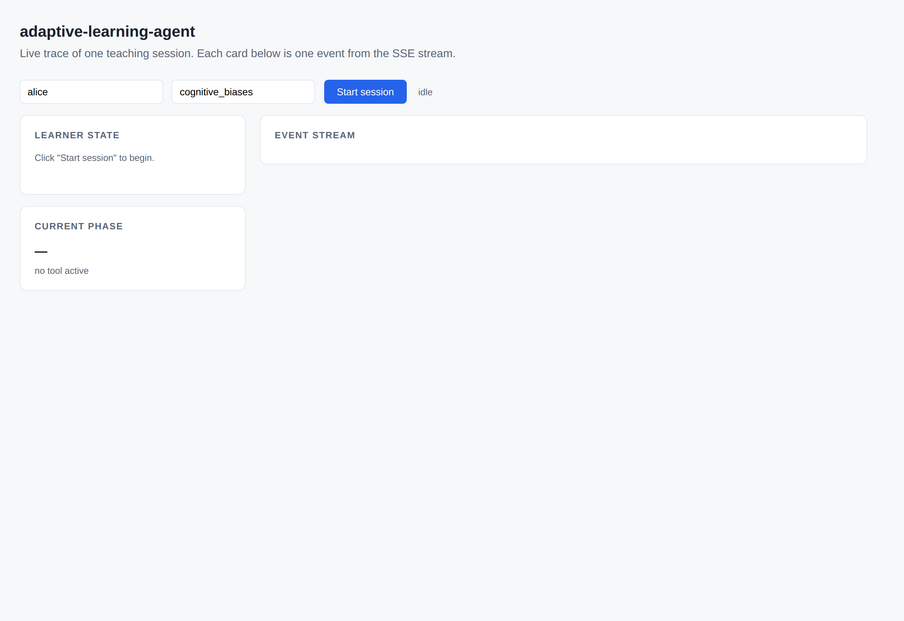
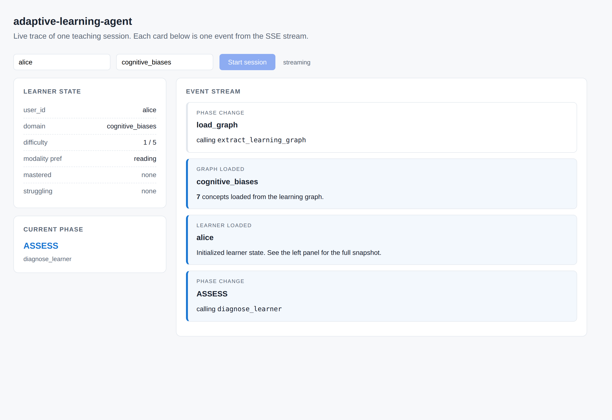
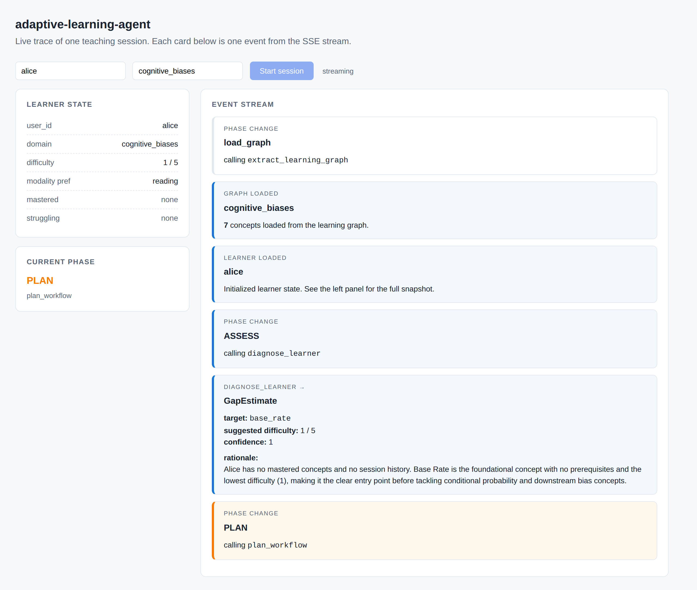
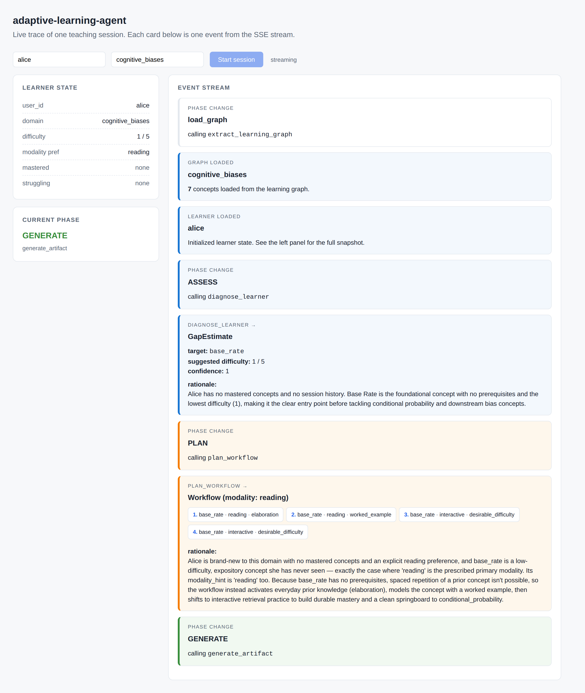
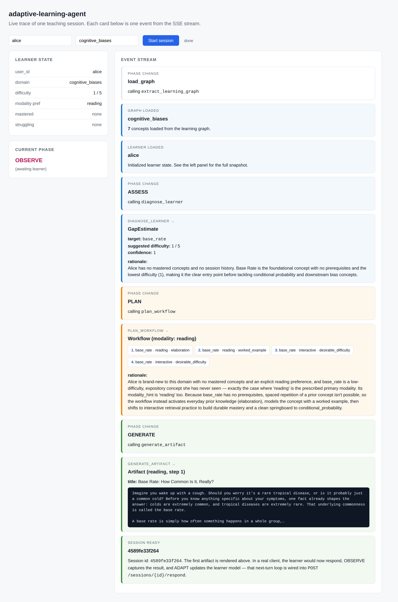

# Visual walkthrough

A real session, captured live by Playwright. Six screenshots, one per phase of the loop. Full video at [`visual/screens/full_session.webm`](visual/screens/full_session.webm) (~4 MB).

Reproduce locally:

```bash
# terminal 1
python run_server.py

# terminal 2
node scripts/capture_visual.mjs   # writes to docs/visual/screens/
```

Or just open `http://localhost:8000/visual/` in a browser — that's the same page Playwright drives. The UI is a single static HTML file ([`visual/index.html`](visual/index.html)) that consumes the existing `/sessions/start_stream` SSE endpoint and renders each event as a card.

---

## 1. Initial state



Empty UI before anything happens. Two input fields (user_id + domain), one button. No magic — when "Start session" is clicked, the page POSTs to `/sessions/start_stream` and renders each SSE event as it lands.

---

## 2. Graph loaded



First two SSE events arrive: `phase: load_graph` (the system is calling `extract_learning_graph`), then `graph` (7 concepts loaded). The graph is served from cache; on a brand-new domain this is where the LLM call to extract structure from source material would happen.

---

## 3. Gap diagnosed



Now the agent's first real decision. The `ASSESS` phase fires, `diagnose_learner` runs, and the `gap` event lands with the diagnosis:

- **target:** `base_rate`
- **suggested difficulty:** 1/5
- **confidence:** 1.0
- **rationale:** *"Alice has no mastered concepts and no session history. Base Rate is the foundational concept with no prerequisites and the lowest difficulty, making it the clear entry point before tackling conditional probability and downstream bias concepts."*

This is `case_01_novice_start` behavior — empty learner state, agent correctly picks a foundational concept rather than dropping the learner into the middle of the graph.

---

## 4. Workflow planned



`plan_workflow` returns: **5 steps, modality reading**. The chips show each step's concept + modality + pedagogy principle:

- Step 1: `base_rate` · reading · elaboration
- Step 2: `base_rate` · reading · worked_example
- Step 3: `base_rate` · interactive · desirable_difficulty
- Step 4: `base_rate` · interactive · desirable_difficulty
- Step 5: `base_rate` · interactive · spaced_repetition

The agent's rationale explains the modality choice: brand-new concept, no misconceptions yet ⇒ reading; then it pivots to interactive for retrieval practice (desirable difficulty); finally a spaced-repetition step toward the end.

---

## 5. Artifact generated


`generate_artifact` produces the actual reading passage for step 1. The card shows a preview — title and first chunk of the body. In a real UI, the learner would read this and respond.

---

## 6. Session ready



Final `session_ready` event with the session id. The page transitions to the OBSERVE phase — the loop is now paused, waiting for the learner to respond via `POST /sessions/{id}/respond`. That next-turn cycle (OBSERVE → ADAPT → back to ASSESS with updated state) runs on each `/respond` call, the same way.

---

## What this proves

The five SSE phases match the five tools 1:1, and you can watch them in order without inferring anything:

| Phase chip on screen | Tool that fires | Output |
|---|---|---|
| `load_graph` | `extract_learning_graph` | `LearningGraph` |
| `ASSESS` | `diagnose_learner` | `GapEstimate` |
| `PLAN` | `plan_workflow` | `Workflow` |
| `GENERATE` | `generate_artifact` | `Artifact` |
| `OBSERVE` | *(waiting on POST /respond)* | `SessionTurn` |
| `ADAPT` | `update_learner_model` | updated `LearnerModel` |

This is the same architecture diagram from the README, just rendered as a live event stream. Every card is one validated Pydantic model coming back from one tool call. No hidden state, no inferred steps — what you see on the page is what's in the codebase.
