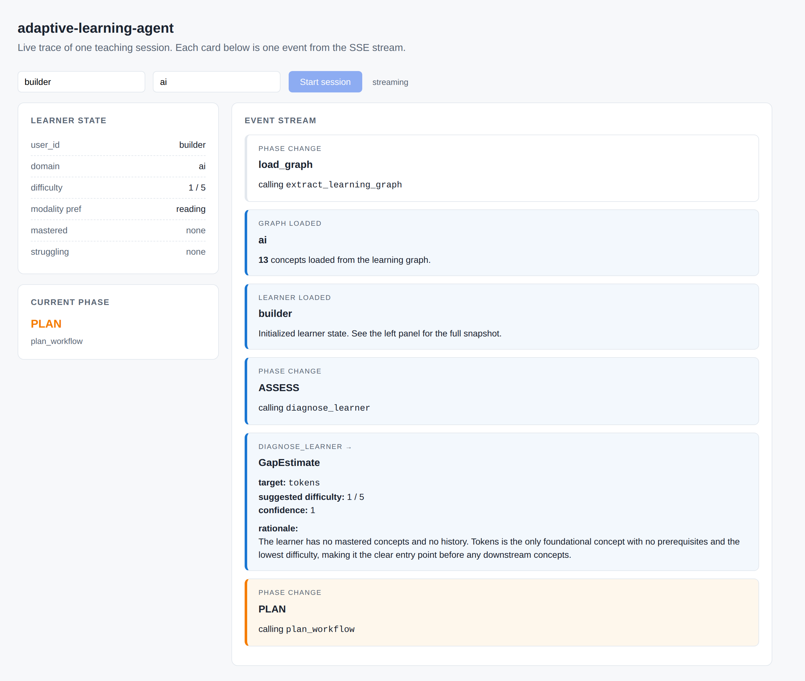

# Use case: learning AI

The agent applied to a topic you build with. One Markdown file ([`domains/ai.md`](../domains/ai.md)) → LLM-extracted learning graph → two sessions on the same learner showing two different adaptation patterns.

---

## What goes in

A 13-concept source file covering tokens, embeddings, attention, transformers, context window, prompt engineering, structured outputs, tool use, agents, RAG, evals, LLM-as-judge, and hallucination. Markdown. ~3KB. That's the entire input — no schemas, no templates, no hand-curated dependencies.

## What comes out (step 1 — the graph)

After one LLM call, the extracted graph has **13 nodes** (one per concept) and **21 edges** — mostly prerequisites the agent inferred from the text itself.

Notable: it identified two *interleave-with* pairs — concepts the agent will deliberately mix during practice because they're commonly conflated:

| Pair | Why they interleave |
|---|---|
| `structured_outputs` ↔ `tool_use` | Both constrain the model to JSON; easy to confuse the mechanisms |
| `embeddings` ↔ `attention` | Both involve vector representations; learners often blur the boundary |

These weren't seeded — the agent inferred them from the source material.

---

## Session 1 — fresh learner

**Input:** Alice ("builder") has never opened an AI topic. Empty mastery, empty struggles, prefers reading.

**Output (live capture):**

| Decision | What | Why |
|---|---|---|
| Target | `tokens` | "Tokens is the only foundational concept with no prerequisites and the lowest difficulty, making it the clear entry point before any downstream concepts." |
| Modality | `reading` | New expository material + learner prefers reading + no misconception to surface. Socratic isn't warranted. |
| Difficulty | 1/5 | Novice; no prior signal to step up or down. |

The agent then generated the actual reading passage (~700 words). The opening:

> When you read a sentence, you probably see whole words, like "reading" or "banana." You might even notice individual letters if you're spelling something out loud. But large language models (LLMs) — the technology behind AI chatbots — don't read the way you do. They break text into pieces called **tokens**.
>
> A token is a chunk of text. Sometimes a token is a whole word, like "cat." But often a token is just part of a word. For example, the word "reading" might be split into two tokens: "read" and "ing." Think of tokens like the puzzle pieces of language. The model snaps these pieces together to understand and create text.
>
> Here's a handy rule of thumb: in English, one token is roughly **4 characters**, or about three-quarters of a word…

Plus 5 key takeaways the agent extracted to anchor the lesson.

**Full session capture:** [01_initial.png](visual/ai_screens/01_initial.png) → [02_graph_loaded.png](visual/ai_screens/02_graph_loaded.png) → [03_gap_diagnosed.png](visual/ai_screens/03_gap_diagnosed.png) → [04_workflow_planned.png](visual/ai_screens/04_workflow_planned.png) → [05_artifact_generated.png](visual/ai_screens/05_artifact_generated.png) → [06_session_ready.png](visual/ai_screens/06_session_ready.png).

**Full reasoning trace** (every LLM call + the model's actual thinking + outputs): [`docs/traces/ai_fresh.md`](traces/ai_fresh.md).

---

## Session 2 — mid-journey learner (the more interesting one)

**Input:** Same learner, later. They've mastered `tokens`, `embeddings`, `attention`, `transformers`. They tried `tool_use` twice via reading. Both failed. Difficulty 3, still prefers reading.

**Output:**

| Decision | What | Why |
|---|---|---|
| Target | **`context_window`** *(NOT `tool_use`)* | The agent inspected the prerequisite chain and noticed `tool_use` depends on `context_window`, which the learner has never mastered. So it backfilled. |
| Modality | `reading` | The new target is fresh expository material — the learner has never been taught it. Socratic would be wrong here. (Socratic kicks in for the actual struggling concept — a future session.) |
| Difficulty | 2/5 | One step below current; gentle re-onramp after two failures. |

This is the **prerequisite-gap-blocks-advance** pattern (`case_06` in the eval harness) playing out unprompted on a brand-new domain. The system didn't have any hardcoded knowledge that "tool use requires context window" — it inferred the dependency at graph-extraction time and acted on it at diagnose time.

The workflow it produced:

1. `tokens` — reading, spaced repetition (reactivate the foundation)
2. `attention` — reading, elaboration (connect to the mechanism context windows constrain)
3. `context_window` — reading, worked example (the new key teaching step)
4. `context_window` — interactive, desirable difficulty (retrieval practice)

The generated reading artifact opened with an analogy and immediately tied back to two of the four mastered concepts:

> Imagine a desk that can only hold a fixed number of papers at once. To read a new page, you sometimes have to slide an old one off the edge. A language model works the same way. Its **context window** is the maximum number of tokens it can attend to in a single request — the hard ceiling on its working memory.
>
> Remember that tokens are the small chunks (roughly 3-4 characters, or about ¾ of a word) that text is broken into before the model processes it. The attention mechanism lets the model look at every token in the window and weigh how they relate. But it can only attend to tokens that fit inside the window. Anything beyond the ceiling is simply not seen.
>
> Here's the key insight: **everything counts against the ceiling** — your system instructions, the conversation history, the current prompt, AND the response the model generates…

The bolded "Remember that tokens are…" and "The attention mechanism lets…" sentences are doing elaboration as a pedagogy principle, by name — pulling from concepts the learner *just mastered* to ground the new one. Not generic prose; targeted scaffolding.

**Full reasoning trace:** [`docs/traces/ai_struggling.md`](traces/ai_struggling.md).

---

## What this proves on a topic you understand

1. **The graph is real.** Thirteen concepts, twenty-one prerequisite edges, two interleave-with pairs — none of which were seeded. The structure came from the text.
2. **The agent's decisions are inspectable.** Every cell in the tables above came from a captured LLM call you can re-read with its prompt, the model's reasoning, and the parsed output.
3. **The adaptation rules generalize.** The same prerequisite-backfill behavior that the cognitive-biases eval suite tests for (`case_06`) shows up on the AI domain too, without code changes.
4. **The output is usable.** The generated reading isn't filler — it cites mastered concepts by name to scaffold the new one, which is *exactly* what the pedagogy principle attached to that step (`elaboration`) is supposed to do.

The next sessions, once the learner masters `context_window`, would target the actually-struggling `tool_use` — and *then* the modality routing would probably shift to Socratic, because at that point we'd have a known misconception to surface rather than a gap to fill.
